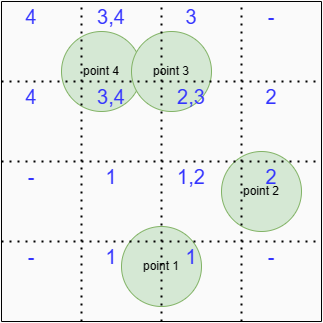

# 并行程序设计 代码报告：openMP / CUDA
> 2100011025 王奕博

在本次大作业中，我总共提交了四个版本的计算Hamilton矩阵代码，分别是**未经优化的串行代码、优化之后的串行代码、openMP版本的并行代码，和CUDA版本的并行代码。** 此外，我还提交了两个版本的对角化矩阵代码，分别使用**串行式调用lapack和并行式调用scalapack** 进行对角化。这两种代码组合使用，可以高效的完成任务。

在这份代码报告中，我将从一下几个方面展示代码：**1.串行优化；2.openMP算法及优化；3.CUDA算法及优化；4.scalapack的使用。** 

## 1.串行优化
### 1.1 大格点-预处理
大作业要求计算的积分可以通过两种方式进行计算，第一种是将点（或者说粒子）的循环作为外层循环，第二种则是将格点的循环作为外层循环。

我的作业里考虑**将格点作为最外层循环** ，是考虑了以下因素：1.格点相对点（粒子）更好分割，可拓展性强；2.作业样例中有只有2个点（粒子）的测试样例，如果此时把点作为外层循环的话，在并行化的时候就会难以均匀把计算量分配到多个进程上。

然而，这样的选择相对将粒子作为外层循环也有其劣势，因为当我们将粒子作为外层循环时，我们只需要从点的附近开始遍历格点就行，无需遍历多个格点；而如果将格点作为外层循环并且不加以优化的话，就会多出许多计算量。尤其是在本例中，粒子在空间的分布是稀疏的，因此如果不加以优化的话，就会浪费掉很多的计算量。

因此，我使用了**大格点预处理-小格点循环**的方式进行处理。它的思想如下：


>首先将整个空间用自己定义的更大的格点进行分割，比如程序中采用的是每一边30等分。之后，**计算每一个大格点和哪些粒子相交**，并存储此信息。之后再**对每一个大格点包含的小格点**进行循环，此时**只需要计算和大格点相交的粒子的信息**，极大的减少了计算量。

用图片示意，即为：



图中的大格点把每个边分成了四份，然后每个大格点储存和这个大格点相交的粒子信息，蓝色字表示与当个格点相交的粒子编号。在技术细节上，这个信息是通过对整型变量进行位运算来存储的，由于需要记录五十个粒子，也就是五十个字节，这里使用long long int 型数组进行存储。

我将这个过程写在了prep(short for preprocess)类中，这个类的成员变量包括：

```c
class Prep {
public:
  long long int *info;
  int nx, ny, nz;
  double lx, ly, lz;
  double cutoff;
  Prep(int x, int y, int z, double lx, double ly, double lz, double c): nx(x), ny(y), nz(z), lx(lx), ly(ly), lz(lz), cutoff(c) 
  {
    info = new long long int[x * y * z + 10];
    memset(info, 0, sizeof(info));
  }
  void update(double px, double py, double pz, int id);
}
```
info数组表示大格点内部信息，update函数则是更新了info数组的信息。

实验表明，加上此优化后，程序的性能**得到了极大的提高** ，和使用粒子作为外层循环的方式不相上下。并且，程序依然保留了方便并行化、方便尺寸管理的特性。在我的电脑上，原本不加此优化的版本在某组数据集中需要运行几分钟，而加了之后则只需要运行几秒。
### 1.2 其它优化

在进行样条插值时，需要进行许多次乘法与除法。为了让进行的运算尽可能少，我**尽可能的合并了相同的运算** ，具体如下：
```c
double spline(double x) {
    int p;
    p = int(x * n / len) + 1;
    double ans = 0;
    double h = len / n;
    double dx_1 = x - (len * (p - 1)) / n;
    double dx_2 = x - (len * p) / n;
    double frac_1 = dx_1 / h;
    double frac_2 = dx_2 / h;
    ans =
        ((1 + 2 * frac_1) * value[p - 1] + dx_1 * y[p - 1]) * frac_2 * frac_2 +
        ((1 - 2 * frac_2) * value[p] + dx_2 * y[p]) * frac_1 * frac_1;
    return ans;
  }
```
此外，在头文件./include/itpln.h中，我还支持了线性插值，虽然在主程序中使用的仍然为样条插值。

并且，根号函数sqrt是一个计算量较大的函数。因此，当计算某个格点与粒子的距离时，我**尽可能少用sqrt函数**。比如，我先通过平方判断是否和粒子的距离相差一个cutoff以内，只有在两者相近的情况下，我才会使用sqrt函数。

## 2.并行算法: openMP

openMP版本的并行代码整体在上述优化之后的串行代码上运行，也就是说直接在主要循环外侧加上parallel for。由于大多数CPU处理器数量不多，而我对大格点的划分就是每一边30个，因此只在最外侧循环加上了：
```c
#pragma omp parallel for collapse(3)
```
这样，将大格点的计算量均匀划给每一个thread。

### 2.1 对内存的管理

由于在计算完成之后，每一个进程需要向全局内存写入本小块的计算结果，为了不引起数据竞争，这里采用critical:
```c
#pragma omp critical
            {
              if (p_i == p_j)
                hamilton[p_i][p_j] += sum;
              else {
                hamilton[p_i][p_j] += sum;
                hamilton[p_j][p_i] += sum;
              }
            }
```

## 3.并行算法:CUDA

在写CUDA程序时，由于GPU不同的架构模式，我采用了完全不同的写法，将每一对点的全部计算量分配到一个block中，然后将其中的格点均分到每一个thread上。

在写CUDA程序的时候我使用了更多的优化，如下：

### 3.1 对点的预处理和block分配

### 3.2 共享内存的使用与规约

### 3.3 动态划分thread数

## 4.scalapack的调用