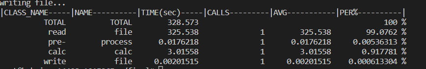
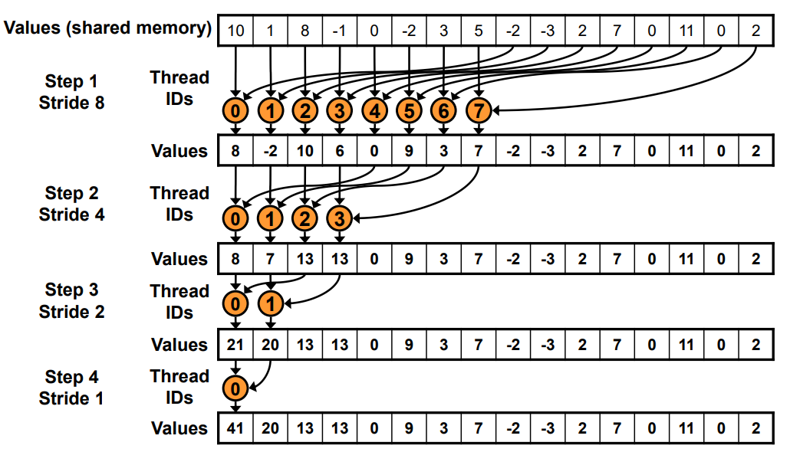
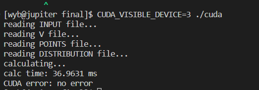

# 并行程序设计 代码报告：openMP / CUDA
> 2100011025 王奕博

在本次大作业中，我总共提交了四个版本的计算Hamilton矩阵代码，分别是**未经优化的串行代码、优化之后的串行代码、openMP版本的并行代码，和CUDA版本的并行代码。** 此外，我还提交了两个版本的对角化矩阵代码，分别使用**串行式调用lapack和并行式调用scalapack** 进行对角化。这两种代码组合使用，可以高效的完成任务。

在这份代码报告中，我将从一下几个方面展示代码：**1.串行优化；2.openMP算法及优化；3.CUDA算法及优化；4.scalapack的使用。** 

## 1.串行优化
### 1.1 大格点-预处理
大作业要求计算的积分可以通过两种方式进行计算，第一种是将点（或者说粒子）的循环作为外层循环，第二种则是将格点的循环作为外层循环。

我的作业里考虑**将格点作为最外层循环** ，是考虑了以下因素：1.格点相对点（粒子）更好分割，可拓展性强；2.作业样例中有只有2个点（粒子）的测试样例，如果此时把点作为外层循环的话，在并行化的时候就会难以均匀把计算量分配到多个进程上。

然而，这样的选择相对将粒子作为外层循环也有其劣势，因为当我们将粒子作为外层循环时，我们只需要从点的附近开始遍历格点就行，无需遍历多个格点；而如果将格点作为外层循环并且不加以优化的话，就会多出许多计算量。尤其是在本例中，粒子在空间的分布是稀疏的，因此如果不加以优化的话，就会浪费掉很多的计算量。

因此，我使用了**大格点预处理-小格点循环**的方式进行处理。它的思想如下：


>首先将整个空间用自己定义的更大的格点进行分割，比如程序中采用的是每一边30等分。之后，**计算每一个大格点和哪些粒子相交**，并存储此信息。之后再**对每一个大格点包含的小格点**进行循环，此时**只需要计算和大格点相交的粒子的信息**，极大的减少了计算量。

用图片示意，即为：


图中的大格点把每个边分成了四份，然后每个大格点储存和这个大格点相交的粒子信息，蓝色字表示与当个格点相交的粒子编号。在技术细节上，这个信息是通过对整型变量进行位运算来存储的，由于需要记录五十个粒子，也就是五十个字节，这里使用long long int 型数组进行存储。

**这相当于本来要算很多格点，现在只需要算点附近的大格点内部的小格点，相当于把每个点放在了一个小正方体内并且只计算这个小正方体中的点，极大的提高了效率。**

我将这个过程写在了prep(short for preprocess)类中，它在preprocess.h的头文件中，这个类的成员变量包括：

```c
class Prep {
public:
  long long int *info;
  int nx, ny, nz;
  double lx, ly, lz;
  double cutoff;
  Prep(int x, int y, int z, double lx, double ly, double lz, double c): nx(x), ny(y), nz(z), lx(lx), ly(ly), lz(lz), cutoff(c) 
  {
    info = new long long int[x * y * z + 10];
    memset(info, 0, sizeof(info));
  }
  void update(double px, double py, double pz, int id);
}
```
info数组表示大格点内部信息，update函数则是更新了info数组的信息。

实验表明，加上此优化后，程序的性能**得到了极大的提高** ，和使用粒子作为外层循环的方式不相上下。并且，程序依然保留了方便并行化、方便尺寸管理的特性。在我的电脑上，原本不加此优化的版本在某组数据集中需要运行几分钟，而加了之后则只需要运行几秒。
### 1.2 其它优化

在进行样条插值时，需要进行许多次乘法与除法。为了让进行的运算尽可能少，我**尽可能的合并了相同的运算** ，具体如下：
```c
double spline(double x) {
    int p;
    p = int(x * n / len) + 1;
    double ans = 0;
    double h = len / n;
    double dx_1 = x - (len * (p - 1)) / n;
    double dx_2 = x - (len * p) / n;
    double frac_1 = dx_1 / h;
    double frac_2 = dx_2 / h;
    ans =
        ((1 + 2 * frac_1) * value[p - 1] + dx_1 * y[p - 1]) * frac_2 * frac_2 +
        ((1 - 2 * frac_2) * value[p] + dx_2 * y[p]) * frac_1 * frac_1;
    return ans;
  }
```
此外，在头文件./include/itpln.h中，我还支持了线性插值，虽然在主程序中使用的仍然为样条插值。

并且，根号函数sqrt是一个计算量较大的函数。因此，当计算某个格点与粒子的距离时，我**尽可能少用sqrt函数**。比如，我先通过平方判断是否和粒子的距离相差一个cutoff以内，只有在两者相近的情况下，我才会使用sqrt函数。

## 2.并行算法: openMP

openMP版本的并行代码整体在上述优化之后的串行代码上运行，也就是说直接在主要循环外侧加上parallel for。由于大多数CPU处理器数量不多，而我对大格点的划分就是每一边30个，因此只在最外侧循环加上了：
```c
#pragma omp parallel for collapse(3)
```
这样，将大格点的计算量均匀划给每一个thread。

### 2.1 对内存的管理

由于在计算完成之后，每一个进程需要向全局内存写入本小块的计算结果，为了不引起数据竞争，这里采用critical:
```c
#pragma omp critical
            {
              if (p_i == p_j)
                hamilton[p_i][p_j] += sum;
              else {
                hamilton[p_i][p_j] += sum;
                hamilton[p_j][p_i] += sum;
              }
            }
```

### 2.2 预期效果

我在bohrium服务器上运行V1024，Point50的测试数据，得到的结果如下：



可以看出，对于最大的一组数据，程序的计算时间需要大约3秒。

## 3.并行算法:CUDA

在写CUDA程序时，由于GPU不同的架构模式，我采用了完全不同的写法，将每一对点的全部计算量分配到一个block中，然后将其中的格点均分到每一个thread上。

在写CUDA程序的时候我使用了更多的优化，如下：

### 3.1 对点的预处理和block分配

如果将每两个点都存放在一个block中，那么一共需要存放50*50=2500个block。然而，由于点在空间中的存放比较稀疏，因此并不需要把每两个点都放在一个block中，只需要**计算有相交的点（粒子）对**。

因此，先对点进行一次遍历，计算两个点之间的距离是否小于两倍的cutoff，只有在这种情况下才会把这两个点以及对应的数据放入block内。这一段的预处理关键代码如下：
```c
bool cross[50][50];
  for (int i = 0; i < point_num; i++) {
    cross[i][i] = 1;
    for (int j = i + 1; j < 50; j++) {
      double dist2 =
          (x1 - x2) * (x1 - x2) + (y1 - y2) * (y1 - y2) + (z1 - z2) * (z1 - z2);
      if (dist2 < 4 * cutoff * cutoff) {
        cross[i][j] = cross[j][i] = 1;
      } else
        cross[i][j] = cross[j][i] = 0;
    }
  }

  int grid_size = 0;
  // these variables go into GPU.
  int calc_point_1[200];
  int calc_point_2[200];
  for (int i = 0; i < 50; i++) {
    for (int j = i; j < 50; j++) {
      if (cross[i][j]) {
        calc_point_1[grid_size] = i;
        calc_point_2[grid_size] = j;
        grid_size++;
      }
    }
  }
```

也就是说，**算出来的Hamilton矩阵（只算上半部分，对称的不算）有多少非零元素，程序就会申请多少个block。** 同时，在每个block内，对thread的划分也是动态的。具体请见下半部分。

### 3.2 动态划分thread数

当上述步骤将一对点划分到一个block内的时候，程序就只需要计算在这两个点附近的格点。因此，之后计算的是**多大的格点组成的正方体可以刚好盖住这个点的cutoff内部区域**（如果是两个点取交集的话，这个交集必定在其中一个点的cutoff内部，因此直接取其中一个点的最小覆盖小正方体就可以满足要求），然后在之后的计算中只处理这一部分区域。

这一部分的计算很简单，如下：
```c
int cube_radius = int(cutoff / (lx / nx)) + 1;
int cube_len = 2 * cube_radius + 1;
```
然而，还要考虑到的是thread的数量和这个小正方体中的格点数量的比例是不确定并且变化很大的。在使用的GPU机器上一般能支持运行的thread数大约在1000左右浮动，在V划分数较小时，总格点数可能小于最大thread数，这时可以每个格点都有一个thead来计算；在V划分较大的时候，有可能每个thread要计算上千个格点。因此，为了均匀划分thread，我根据数据量的大小划分了三种环境（设N为每个小正方体的每一边的格点数量，N^3则为总格点数量）：

1. N^3 < MAX_THREADS,此时将thread数量设置为N^3，刚好每个thread算一个点；

2. N^2 < MAX_THREADS < N^3,此时将threads数量设置为N^2，每个thread计算一条边，也就是N个格点；

3. N^2 > MAX_THREADS,这是最常见的情况，则通过整除等运算尽可能的均匀分布计算负荷。

### 3.3 共享内存的使用

由于共享内存更快的读写速度，因此我们考虑把每个thread最终的运算节点保存在共享内存中。由于程序每个block有最多800个（在大多数情况下，就是800个）thread，因此共享内存需要申请800个浮点数。（有一个小问题就是kernal函数的共享内存传入double型总会报错，因此按照nVidia的建议，传入的共享内存使用float型。当然，大部分的计算使用的还是double，只是在最后一步转成了float，之后再转回double）

编号为index的thread计算完所有格点之后，会将sum放入共享内存shared_num[index]位置。在之后，我们会对这个数组进行规约。这样可以最大化的利用GPU的各种硬件优势，如共享内存的较快的访问速度。

### 3.4 规约

如果使用atomicAdd将shared_num的每一个元素加在一起的话，其运算复杂度是O(n)的，因为使用原子操作时相当于在进行串行计算。然而，如果采用“二分”的思想，可以将复杂度降低到O(log(n))的程度。这里的代码参考了nVidia官方文档，如下：

```c
for (unsigned int s = 1; s < blockDim.x; s *= 2) {
      int temp = 2 * s * index;
      if (temp + s < blockDim.x) {
        shared_num[temp] += shared_num[temp + s];
      }
      __syncthreads();
    }
```

其原理见下图：



每一次计算都并行的用一半线程进行求和，最终会在0号线程处求得数组中全部元素的和，并且复杂度降低到了O(log(n))。

### 3.5 预期效果

我在指定的机器上运行程序，计算V1024，point50的数据，得到的结果如下：



可以看到，对于最大的一组测试样例，计算时间只需要37毫秒左右。